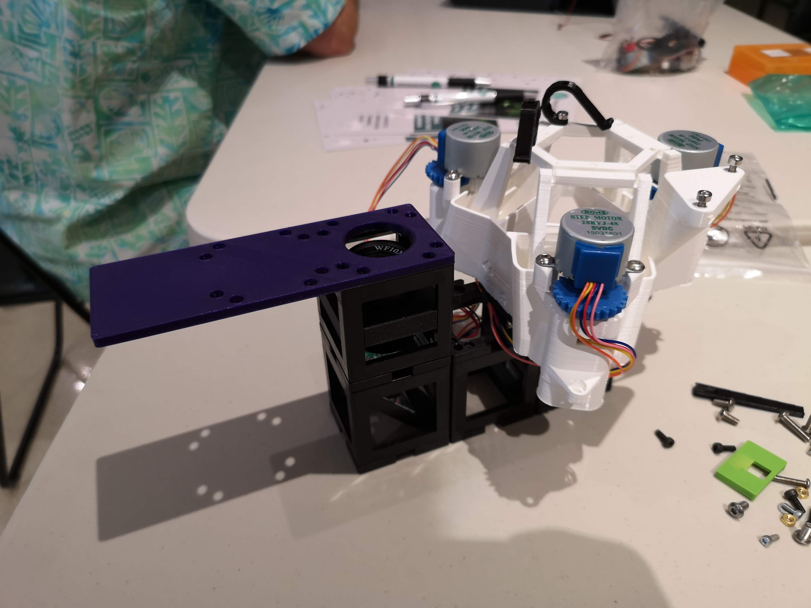
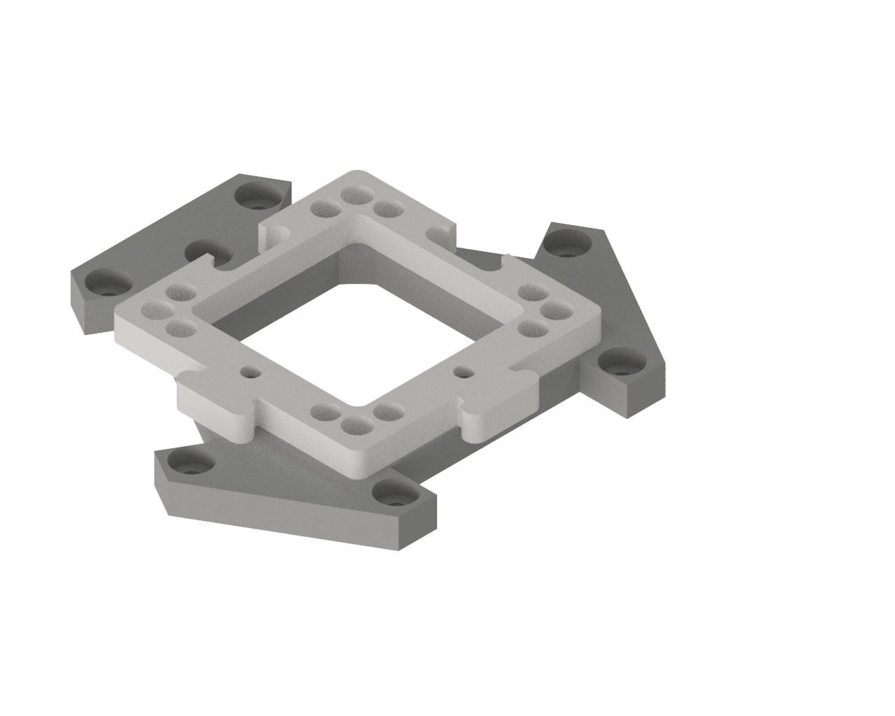

# *OpenFlexure meets UC2*
---

This repo is the ongoing effort to integrate the open-source project [OpenFlexure](https://openflexure.org/) into our UC2 system. We believe this is a perfect match since the nanometer precise flexure stage brings a great benefit to the modular system of UC2. You can easily add fluorescence or quantitative phase imaging to the system. Here we basically provide two adapters for the traditional flexurestage and the deltagstage to adapt them to the IM cubes. In case you need any other adapter, please feel free to reach out to us. We are happy to support your open-source project! :-)

## Cube Insert OpenFlexure (Delta) Stage

This part adapts the OpenFlexure Delta-stage from Richard Bowman's group at the Bath University to the modular optical system UC2. It is basically a plate which has  4 ball-magnets on one side to adapt to 1 UC2 cubes and a flat surface equipped with 3 holes to adapt to the [openflexure delta-stage](https://gitlab.com/openflexure/openflexure-delta-stage/)

It's a work in progress!

Here we combined with with the smartphone readout:

### Purpose
The [OpenFlexure Stage](https://www.openflexure.org) can be downloaded from the official [GitLab](https://gitlab.com/openflexure/openflexure-microscope)-Repository. It's a monolithic XYZ-stage with tremendous precision.

This is the part you will add to your flexure stage (it is one single 3D printed part, don't get confused with the colour):

### Properties

OpenFlexure Stage stacked on the UC2 cubes. A fold-mirror can redirect the beam from the objective lens inside the Z-slide of the stage.
This is an older version, but the mounting mechanism is the same. Add 6 M3 screws and you're done.

### Parts

#### 3D printing parts

1. **The Adapter** which connects one UC2 cubes to the Flexure Delga-Stage [STL-File](./STL/20_Cube_Insert_Openflexure_Deltastage_Adapter_v3.stl)

#### Additional parts
Here we list all parts which need to be bought from different sources.

|  Name | Properties  |  Price | Link  | # |
|---|---|---|---|---|
|  Screws | M3 screws for mounting the stage | 1€  | [Various]()  | 6 |

### Remarks and Tips

#### 3D Printing
Print as is with support on baseplate only. Infill can be around 30%.

## Cube Insert OpenFlexure Stage (deprecated!)

This part adapts the OpenFlexure stage from Richard Bowman's group at the Bath University to the modular optical system UC2. It is basically a plate which has  11 ball-magnets on one side to adapt to 3 UC2 cubes and a flat surface equipped with 2 holes to adapt to the open flexure stage.

It's a work in progress!

A discussion dedicated to this topic can be found [here](https://gitlab.com/openflexure/openflexure-microscope/merge_requests/127) and [here](https://gitlab.com/openflexure/openflexure-microscope/-/merge_requests/127#note_369356216).

### Purpose
The [OpenFlexure Stage](https://www.openflexure.org) can be downloaded from the official [GitLab](https://gitlab.com/openflexure/openflexure-microscope)-Repository. It's a monolithic XYZ-stage with tremendous precision.

### Properties

OpenFlexure Stage stacked on the UC2 cubes. A fold-mirror can redirect the beam from the objective lens inside the Z-slide of the stage.

The Ball-Magnets visualized from below.

### Parts

#### 3D printing parts
The files are in the [RAW](../RAW/STL) folder.

1. **The Adapter** which connects three UC2 cubes to the Flexure-Stage

From the openflexure [Gitlab Forum](https://gitlab.com/openflexure/openflexure-microscope/-/merge_requests/127#note_369356216), you can also get these beautifully designed extra STLs:
[UC2_Cube_3sidedLid_1x1_v2.scad](https://gitlab.com/openflexure/openflexure-microscope/uploads/5f7a4f1760d4105bbbe2628dd03d1788/UC2_Cube_3sidedLid_1x1_v2.scad)
[UC2_Cube_3SidedLid_1x1_v2.stl](https://gitlab.com/openflexure/openflexure-microscope/uploads/5d391f26d9e5a5af608e32ef7a7fc677/UC2_Cube_3SidedLid_1x1_v2.stl)
[JBv2_OpenFlexure_adapter.stl](https://gitlab.com/openflexure/openflexure-microscope/uploads/41b4ef5c7680377cab1c7c783b688931/JBv2_OpenFlexure_adapter.stl)

(C) [John](https://gitlab.com/MisterBurnley)

#### Additional parts
Here we list all parts which need to be bought from different sources.

|  Name | Properties  |  Price | Link  | # |
|---|---|---|---|---|
|  Magnets | 5mm Ball Magnets, Neo Dym | 5€  | [Magnets](https://www.ebay.de/itm/2018-3mm-5mm-216pcs-Magnet-Balls-Magic-Beads-3D-Puzzle-Ball-Sphere-Magnetic-/202315436939)  | 11|

### Remarks and Tips

#### 3D Printing
Print as is without support. Infill can be around 30%.

## Safety
Take care in case you're dealing with lasers. Don't burn yourself if you solder the part!

## Get Involved

This project is open so that anyone can get involved. You don't even have to learn CAD designing or programming. Find ways you can contribute in  [CONTRIBUTING](https://github.com/openUC2/UC2-GIT/blob/master/CONTRIBUTING.md)

## License and Collaboration

This project is open-source and is released under the CERN open hardware license. Our aim is to make the kits commercially available.
We encourage everyone who is using our Toolbox to share their results and ideas, so that the Toolbox keeps improving. It should serve as a easy-to-use and easy-to-access general purpose building block solution for the area of STEAM education. All the design files are generally for free, but we would like to hear from you how is it going.

You're free to fork the project and enhance it. If you have any suggestions to improve it or add any additional functions make a pull-request or file an issue.

Please find the type of licenses [here](https://github.com/openUC2/UC2-GIT/blob/master/License.md)

REMARK: All files have been designed using Autodesk Inventor 2019 (EDUCATION)

## Collaborating
If you find this project useful, please like this repository, follow us on Twitter and cite the webpage! :-)
